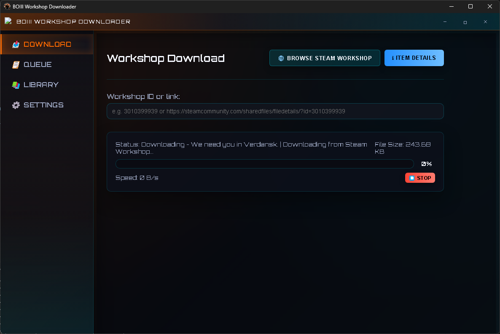
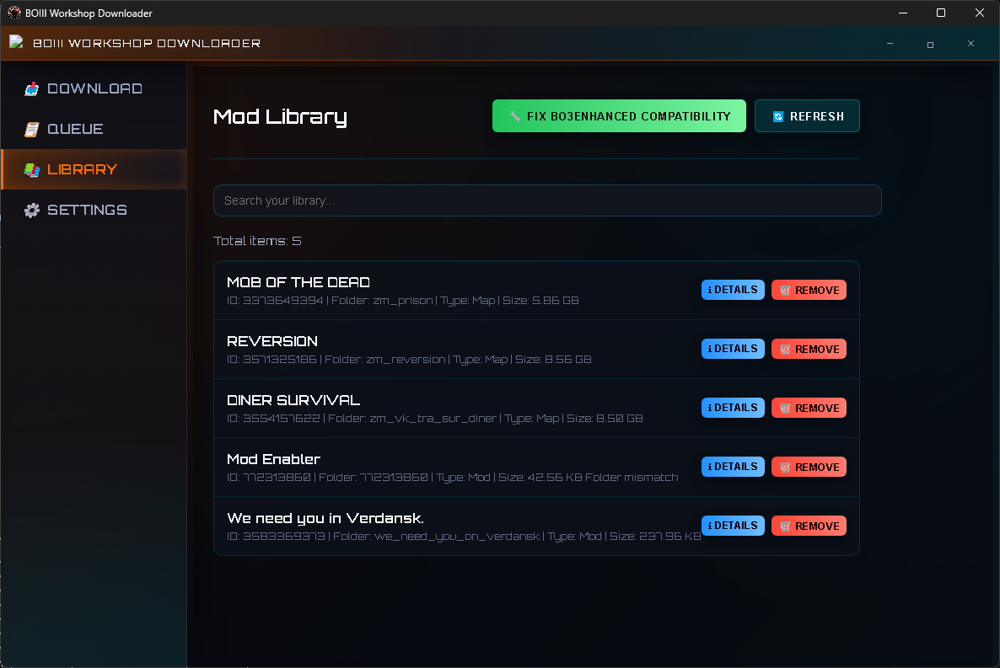

# BOIII WD+ (BOIII Workshop Downloader+)

Modern Electron-based frontend with an embedded Python/Flask backend that automates downloading, managing and updating Steam Workshop items for [Call of Duty®: Black Ops III](https://store.steampowered.com/app/311210/Call_of_Duty_Black_Ops_III/).

## Screenshots

<p align="center">
  
</p>

<p align="center">
  
</p>

## Highlights

- Authentic SteamCMD downloads with queue management and progress smoothing.
- Automatic install/patch flow for mods and maps directly into the game directory.
- Patch for BO3Enhanced compatibility with one click.
- Library view with metadata, update checks, and BO3Enhanced compatibility fixer.
- Backend hardened with fallbacks for missing workshop metadata and large downloads.
- Slick BO3-inspired interface (Electron + Custom CSS) with bundled menu-less window chrome.
- Standalone Windows installer packaged via PyInstaller + electron-builder.

## Quick Start (End Users)

1. Download the latest installer from the Releases page (or build locally via instructions below).
2. Run the **BOIII Workshop Downloader Setup** executable and follow the installer prompts.
3. Launch the app. The bundled backend is started automatically—no extra setup required.
4. Enter a workshop ID or URL and click **Download**. Check the **Library** tab to manage installed content.

## For Developers

```bash
# clone repo
git clone https://github.com/Spet001/BOIIIWD-.git

# Python deps (Flask backend)
python -m pip install -r requirements.txt

# Node deps (Electron renderer)
cd electron
npm install
```

### Run in development mode

```bash
# Terminal 1 – backend API (optional; Electron can spawn it too)
python api/boiiiwd_api_improved.py

# Terminal 2 – Electron UI
cd electron
npm start
```

The Electron main process will default to the system Python script in development. When the prebuilt backend executable exists (`backend_dist/boiiiwd_api.exe`) it will spawn that instead.

### Package the Windows installer

```bash
cd electron
npm run pack:win
```

This command runs PyInstaller (producing `backend_dist/boiiiwd_api.exe`) and then executes `electron-builder --win`, yielding `electron/dist/BOIII Workshop Downloader Setup {version}.exe`. 

## Feature Overview

- **Download queue:** stack multiple workshop items and let the app process them sequentially.
- **Library inspector:** lists installed items, shows disk usage and exposes quick actions (details, open folder, removal).
- **Compatibility tools:** one-click BO3Enhanced fix and workshop transfer helper.
- **Settings tab:** configure SteamCMD path, download directories, and authentication tokens.
- **Custom themes:** dark futuristic palette aligned with BO3’s HUD.

## Project Layout

- `api/` – Flask backend serving download/queue endpoints (SteamCMD orchestration).
- `electron/` – Electron app (renderer, preload, packaging scripts).
- `boiiiwd_package/` – Legacy Python GUI package (still distributable as script).
- `docs/assets/` – Project screenshots used in documentation.
- `utils/enc_key_gen.py` – Helper to generate encryption keys for secure credential storage.

## Credits & License

- Forked and reimagined from the original CustomTkinter-based BOIII Workshop Downloader by @faroukbmiled.
- UI design tailored to mimic Black Ops III aesthetics while keeping the original workflow intact.

**Security tip:** Set the `BOIIIWD_ENC_KEY` environment variable to customize the encryption key used to store your Steam username. Use [`utils/enc_key_gen.py`](utils/enc_key_gen.py) to generate a compliant key.

## License

Released under the terms of the [GNU General Public License v3.0](LICENSE).
